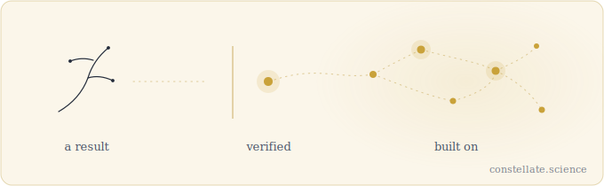

## Will Blair

I build [Vela](https://github.com/constellate-science/vela), version control for scientific state. It's the core of [Constellate](https://constellate.science), open infrastructure for cumulative science.

Vela turns a scientific result into content-addressed, verifier-gated state that anyone can reproduce and build on.

<picture>
  <source media="(prefers-color-scheme: dark)" srcset="vela-dark.svg">
  
</picture>

By day I build researcher-intelligence tooling at an R&D lab in San Francisco.

**Open**
- [constellate-science/vela](https://github.com/constellate-science/vela) — protocol and CLI
- [constellate-science/vela-frontiers](https://github.com/constellate-science/vela-frontiers) — public frontier manifests and VelaBench
- [verified-combinatorics](https://github.com/willblair0708/verified-combinatorics) — independently verifiable extremal results

**Writing** — the Constellate trilogy
- [Constellations of Borrowed Light](https://constellate.science/constellations) — why science needs a shared, living record of its frontier
- [The Discovery Engine](https://constellate.science/discovery-engine) — the engine that turns scientific activity into governed state
- [The Terafactory Age](https://constellate.science/terafactories) — whether that engine reaches the physical world open or closed

Cognitive Science, Johns Hopkins. Z Fellows · Kleiner Perkins · NSERC · Sigma Squared.

[willjblair.com](https://willjblair.com) · [@willjblair1](https://x.com/willjblair1) · [william.blair0708@gmail.com](mailto:william.blair0708@gmail.com)
